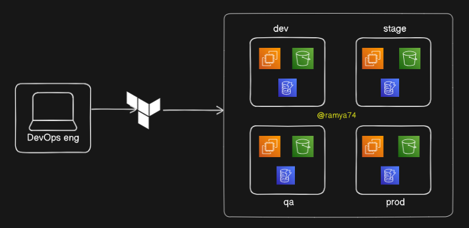
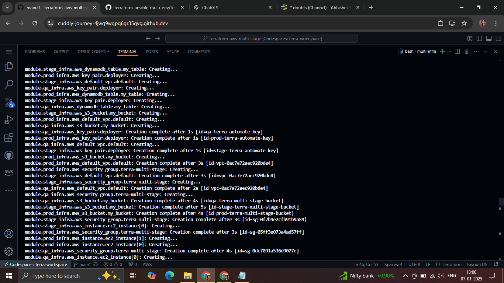
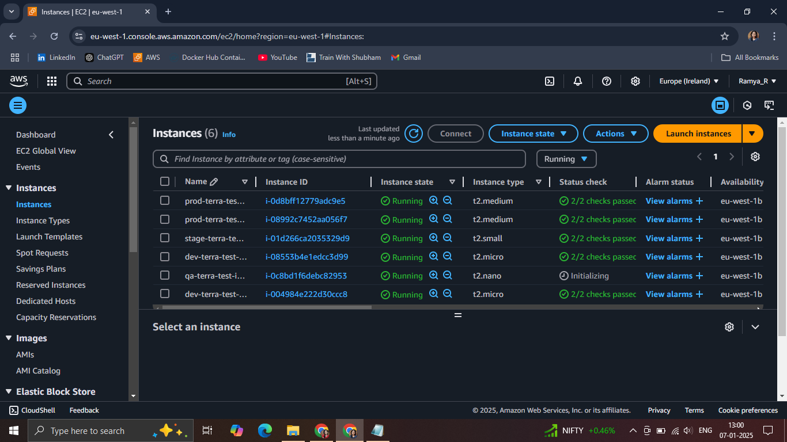
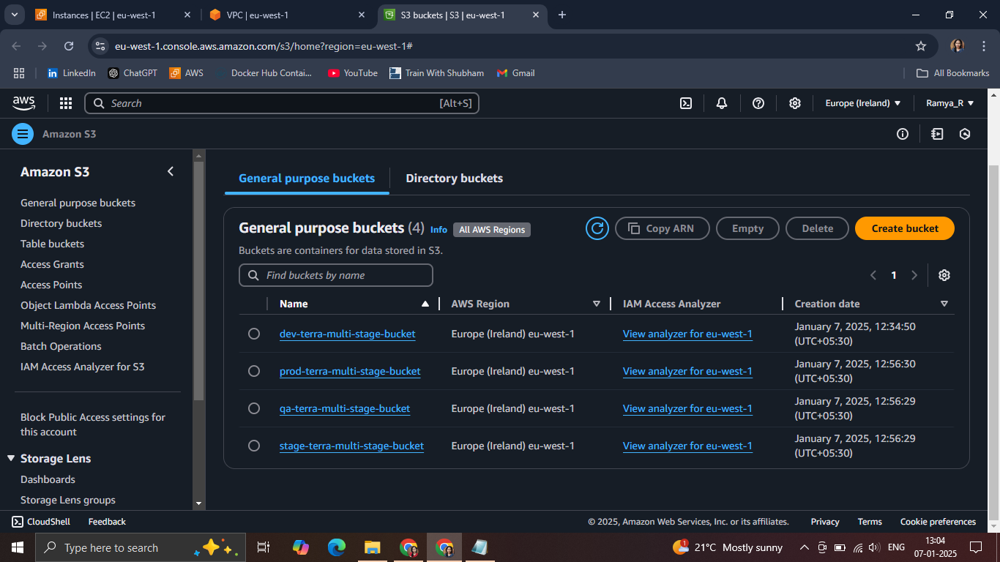
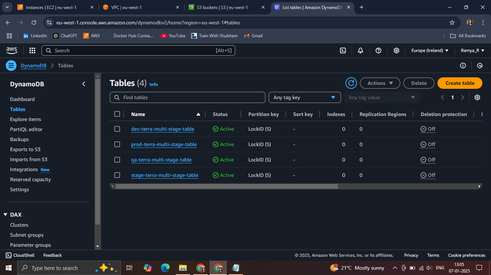

# DevOps Project: Multi-Environment Infrastructure with Terraform
## Introduction

This comprehensive DevOps project demonstrates how to set up a robust, multi-environment infrastructure using Terraform for provisioning and Ansible for configuration management. The project covers creating infrastructure for development, staging, and production environments, with a focus on automation, scalability, and best practices.

## Project Overview

The project involves:

* Installing Terraform and Ansible
    
* Setting up AWS infrastructure
    
* Creating dynamic inventories
    
* Configuring Nginx across multiple environments
    
* Automating infrastructure management
    
## Project Diagram : 




# **1\. Installing Terraform and Ansible**

## **a. Installing Terraform on Ubuntu**

Follow these steps to install Terraform on Ubuntu:

1. **Update the Package List**
    
    ```bash
    sudo apt-get update  
    ```
    
2. **Install Dependencies**
    
    ```bash
    sudo apt-get install -y gnupg software-properties-common  
    ```
    
3. **Add HashiCorp's GPG Key**
    
    ```bash
    curl -fsSL https://apt.releases.hashicorp.com/gpg | sudo gpg --dearmor -o /usr/share/keyrings/hashicorp-archive-keyring.gpg  
    ```
    
4. **Add the HashiCorp Repository**
    
    ```bash
    echo "deb [signed-by=/usr/share/keyrings/hashicorp-archive-keyring.gpg] https://apt.releases.hashicorp.com $(lsb_release -cs) main" | sudo tee /etc/apt/sources.list.d/hashicorp.list  
    ```
    
5. **Install Terraform**
    
    ```bash
    sudo apt-get update && sudo apt-get install terraform  
    ```
    
6. **Verify the Installation**
    
    ```bash
    terraform --version  
    ```
    



---

## **b. Installing Ansible on Ubuntu**

Ansible simplifies configuration management and automation. To install it:

1. **Add the Ansible PPA**
    
    ```bash
    sudo apt-add-repository ppa:ansible/ansible  
    ```
    
2. **Update the Package List**
    
    ```bash
    sudo apt update  
    ```
    
3. **Install Ansible**
    
    ```bash
    sudo apt install ansible  
    ```
    
4. **Verify the Installation**
    
    ```bash
    ansible --version  
    ```
    


---

# 2\. **Creating Directories for Terraform and Ansible**

To keep your infrastructure code and server configuration scripts organized, create two separate directories: one for Terraform and another for Ansible.

1. **Navigate to Your Project Directory** (or create a new one):
    
    ```bash
    mkdir <your-project-name> && cd <your-project-name>
    ```
    
2. **Create a Directory for Terraform**:
    
    ```bash
    mkdir terraform  
    ```
    
3. **Create a Directory for Ansible**:
    
    ```bash
    mkdir ansible  
    ```
    
4. **Verify the Directory Structure**:
    
    ```bash
    tree  
    ```
    
    Your project structure should look like this:
    
    ```bash
    <your-project-name>/  
    ├── terraform/  
    └── ansible/  
    ```
    

With this structure, you can separate your **Terraform scripts** (infrastructure provisioning) and **Ansible playbooks** (server configuration) efficiently.

---

# 3\. **Setting Up Infrastructure Directory in Terraform**

After creating the `modules` directory, add basic configurations to each Terraform file to provision essential AWS resources.

#### **Steps to Create the Infrastructure Directory and Add File Content**

1. **Navigate to the Terraform Directory**:
    
    ```bash
    cd terraform  
    ```
    
2. **Create the** `infra` Directory:
    
    ```bash
    mkdir modules && cd modules
    ```
    
3. **Create and Populate the Terraform Files**: below is code which i have used to create infrastructure structure to accomplish project pattern
    

---

**a.** [`bucket.tf`] (S3 Bucket Configuration) : Refer to the source code provided above


---

**b.** [`dynamodb.tf`] (DynamoDB Table for State Locking) : Refer to the source code provided above

---

**c.** [`ec2.tf`] (EC2 Instance Configuration) : Refer to the source code provided above


---

**d.** [`output.tf`] (Output Definitions) : Refer to the source code provided above


---

**e.** [`variable.tf`] (Variable Declarations) : Refer to the source code provided above


---

4. **Verify the File Structure and Content**:
    
    ```bash
    tree  
    ```
    
    Your structure should look like this:
    
    ```bash
    module/
    ├── s3.tf  
    ├── dynamodb.tf  
    ├── ec2.tf  
    ├── output.tf  
    └── variable.tf  
    ```
    

Each file now contains sample resource configurations which i have used to create that project. You can modify the values in [`variable.tf`] to fit your project’s requirements.

---

# 4\. **Going Back to Terraform Directory and Adding Main Infrastructure Files**

#### **1\. Go Back to the Terraform Directory**

```bash
cd ..
```

#### **2\. Create the** [`main.tf`] File (Using Modules for Multi-Environment Setup)

The [`main.tf`] file will include the configuration to call your `infra` module and create resources for the `dev`, `stage`, and `prod` environments.

- Refer to the source code provided above


In this [`main.tf`], you're defining three modules (dev, stage, prod) using the same `infra` module, but you can customize them with different settings such as the EC2 instance type, AMI, S3 bucket name, and DynamoDB table name.even display output of Public ips as well.

---

#### **3\. Create the** [`providers.tf`] File (AWS Provider Configuration)

This file configures the AWS provider and sets the region and access credentials.

- Refer to the source code provided above

---

#### **4\. Create the** [`terraform.tf`] File

This file is used for initialising terraform aws provider.

- Refer to the source code provided above

---

#### **5\. Generate SSH Keys (**`devops-key` and [`devops-key.pub`])

> note : here I have used key name as devops-key , you can create with any name , and replace that every-where that old one appears,

To create SSH keys for accessing the EC2 winstances, use the `ssh-keygen` command:

```bash
ssh-keygen -t rsa -b 2048 -f devops-key -N ""
```

* This generates two files:
    
    * `devops-key` (private key)
        
    * [`devops-key.pub`] (public key)
        

---

### **Final Directory Structure**

At this point, your Terraform project structure should look like this:

```bash
├── devops-key        # Private SSH key for EC2 access
├── devops-key.pub    # Public SSH key for EC2 access
├── module
│   ├── bucket.tf
│   ├── dynamodb.tf
│   ├── ec2.tf
│   ├── output.tf
│   └── variable.tf
├── main.tf           # Defines environment-based modules
├── providers.tf      # AWS provider configuration
├── terraform.tf      # Backend configuration for state management

```

---

### **Next Steps**

1. #### **Run Terraform Commands**
    

Run the following commands to initialize, plan, and apply your Terraform setup:

a. `terraform init` : Initialize Terraform with the required providers and modules

b. `terraform plan` : Review the plan to apply changes

c. `terraform apply` : Apply the changes to provision infrastructur

> You can see below that all instance , buckets ,dynamodb are running or created , which is created through Terraform :

1. Instances :
    
    
    
2. Buckets :
    
    
    
3. DynamoDb tables:
    
    
    

---
